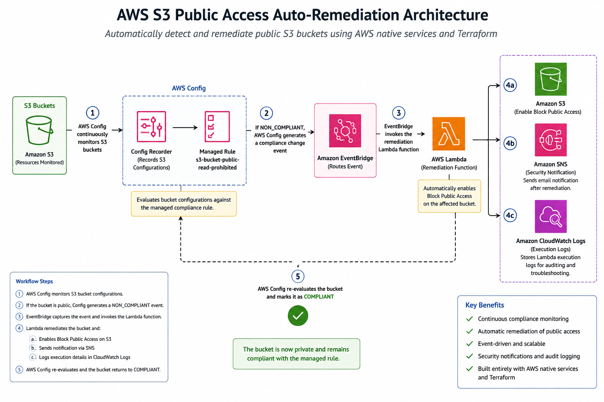
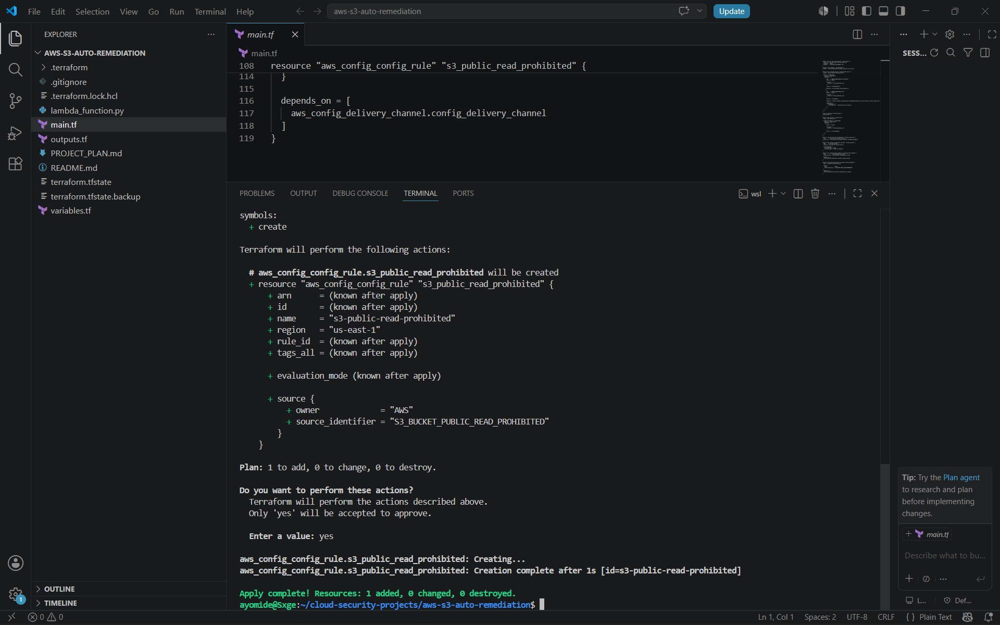
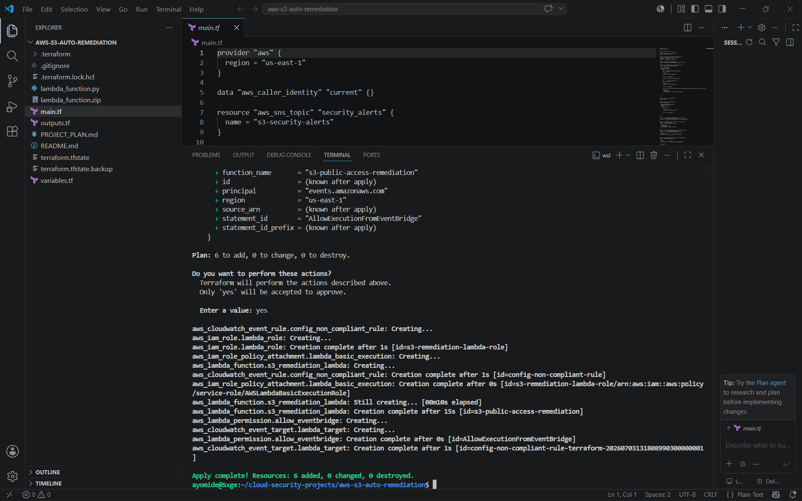
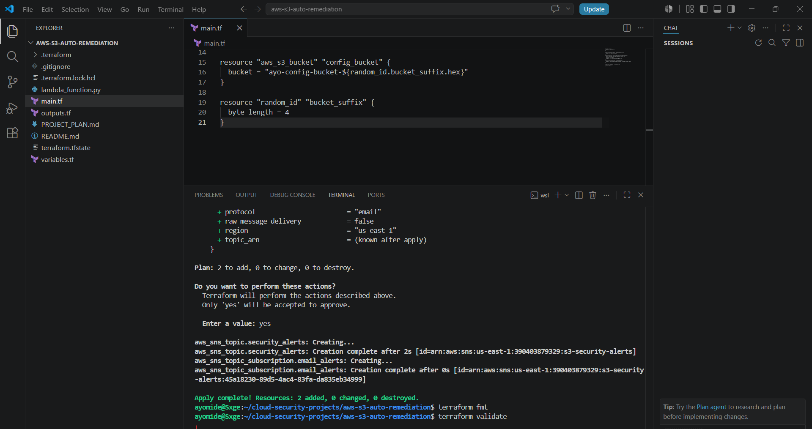
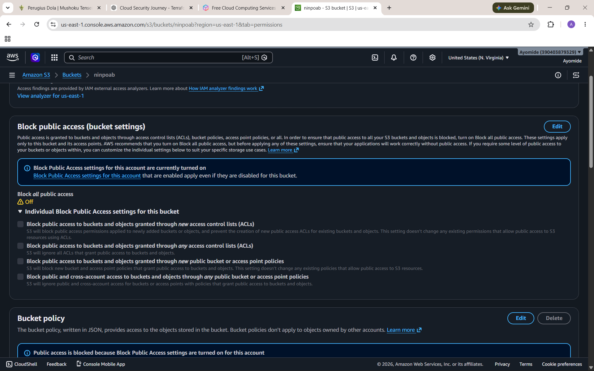
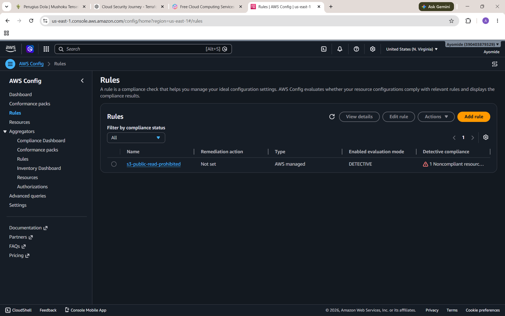
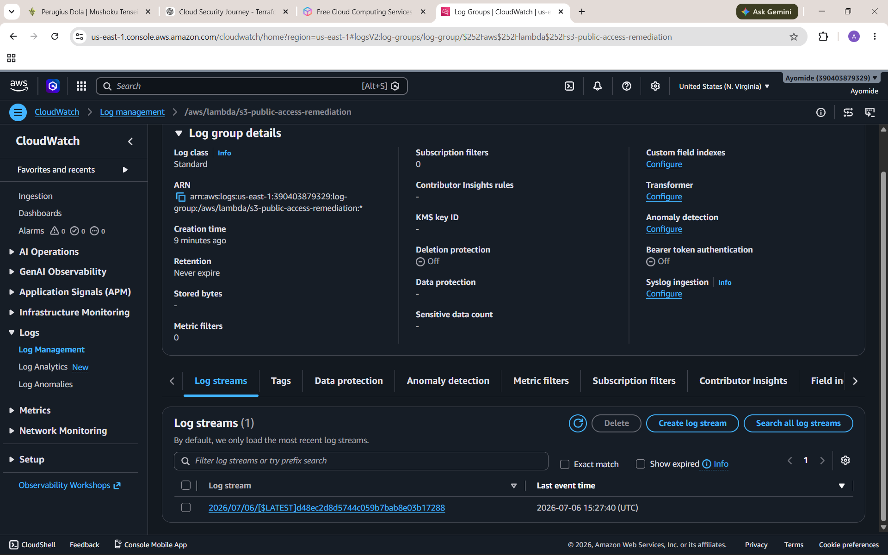
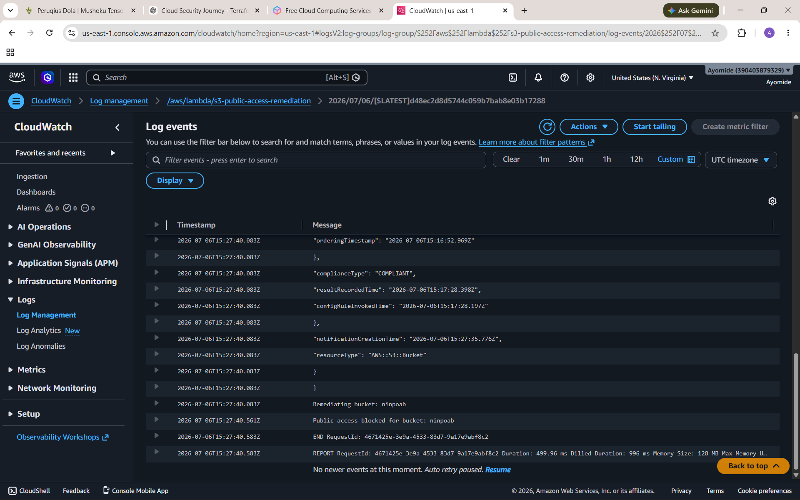

# AWS S3 Public Access Auto-Remediation

## Project Overview

This project demonstrates an automated cloud security remediation workflow that detects and remediates publicly accessible Amazon S3 buckets using AWS native services and Infrastructure as Code (Terraform).

When an S3 bucket becomes publicly accessible, AWS Config continuously evaluates the bucket's compliance against a managed security rule. If the bucket is determined to be non-compliant, Amazon EventBridge routes the compliance change event to an AWS Lambda function. The Lambda function automatically restores the bucket's Block Public Access settings, and Amazon SNS is used to support security notifications.

The project was deployed, tested, and validated in an AWS environment using Terraform, with CloudWatch Logs confirming successful Lambda execution and automatic remediation.

## Problem Statement

Publicly accessible Amazon S3 buckets are one of the most common cloud security misconfigurations and have been responsible for numerous real-world data exposure incidents. A bucket that is accidentally configured for public access can expose sensitive data if the misconfiguration is not detected and corrected quickly.

While manual monitoring is possible, it is slow, error-prone, and does not scale effectively across cloud environments. This project demonstrates how AWS native security services can automatically detect non-compliant S3 buckets and remediate the issue without requiring manual intervention, reducing the time that sensitive resources remain exposed.

## Solution Architecture

The solution uses an event-driven architecture built with AWS native services and Terraform.

AWS Config continuously evaluates Amazon S3 buckets against the managed `s3-bucket-public-read-prohibited` compliance rule. When a bucket becomes non-compliant, AWS Config generates a compliance change event.

Amazon EventBridge captures the compliance event and invokes an AWS Lambda function. The Lambda function automatically enables Block Public Access settings on the affected S3 bucket, restoring the bucket to a compliant state. Amazon SNS is integrated to support security notifications, while Amazon CloudWatch Logs provides execution logs for monitoring and troubleshooting.

Terraform was used to provision and manage all infrastructure, allowing the deployment to be repeatable, consistent, and version-controlled.

### Architecture Diagram



## AWS Services Used

| AWS Service | Purpose |
|------------|---------|
| AWS Config | Continuously evaluates S3 buckets against a managed compliance rule to detect public access. |
| Amazon EventBridge | Routes compliance change events from AWS Config to the Lambda function. |
| AWS Lambda | Automatically remediates non-compliant S3 buckets by enabling Block Public Access settings. |
| Amazon S3 | Stores the bucket being monitored and remediated. |
| Amazon SNS | Supports security notifications after remediation events. |
| Amazon CloudWatch Logs | Captures Lambda execution logs for monitoring and troubleshooting. |
| AWS IAM | Provides least-privilege permissions for AWS Config and Lambda to perform their tasks securely. |
| Terraform | Provisions and manages the AWS infrastructure as code. |

## Workflow

1. An Amazon S3 bucket is monitored by AWS Config.

2. AWS Config continuously evaluates the bucket against the managed `s3-bucket-public-read-prohibited` compliance rule.

3. If the bucket becomes publicly accessible, AWS Config marks the resource as **NON_COMPLIANT** and generates a compliance change event.

4. Amazon EventBridge receives the compliance event and invokes the AWS Lambda remediation function.

5. The Lambda function enables Amazon S3 Block Public Access settings on the affected bucket.

6. Amazon SNS supports security notifications, while Amazon CloudWatch Logs records the remediation activity for auditing and troubleshooting.

7. AWS Config re-evaluates the bucket and confirms that it has returned to a **COMPLIANT** state.

## Terraform Deployment


This project was deployed entirely using Terraform, allowing the infrastructure to be defined as code rather than being created manually through the AWS Management Console.

Using Terraform provides several advantages:

- Repeatable deployments across environments.
- Version-controlled infrastructure through Git.
- Consistent resource configuration.
- Easier maintenance and future enhancements.
- Reduced risk of configuration drift caused by manual changes.

All major AWS resources, including AWS Config, EventBridge, Lambda, SNS, IAM roles, and supporting infrastructure, were provisioned using Terraform.


## Demonstration

The following screenshots demonstrate the successful deployment, execution, and automatic remediation of the solution.

### Terraform Deployment

- AWS Config resources created successfully.
- EventBridge rule and Lambda permissions deployed.
- SNS topic and email subscription created.

### AWS Config

- AWS Config Recorder configured for S3.
- Bucket transitions from **NON_COMPLIANT** to **COMPLIANT** after remediation.

### Lambda & CloudWatch Logs

- CloudWatch Logs confirm successful Lambda execution.
- Logs show the affected bucket being remediated automatically.

### Terraform – AWS Config Deployment

This screenshot shows the successful deployment of the AWS Config resources using Terraform.



---

### Terraform – EventBridge Deployment

This screenshot confirms the successful deployment of the Amazon EventBridge rule, event target, and Lambda permissions.



---

### Terraform – SNS Deployment

This screenshot shows the successful creation of the Amazon SNS topic and email subscription.



---

### AWS Config Recorder

AWS Config Recorder configured to continuously evaluate Amazon S3 resources.



---

### AWS Config – NON_COMPLIANT

AWS Config detects that the S3 bucket violates the managed compliance rule.



---

### AWS Config – COMPLIANT

AWS Config confirms the bucket has returned to a compliant state after the remediation Lambda function executes.


---

### CloudWatch Log Group

CloudWatch Logs containing the Lambda execution history.



---

### CloudWatch Remediation Success

CloudWatch Logs confirm that the Lambda function successfully remediated the affected S3 bucket.



## Security Considerations

This project was designed with cloud security best practices in mind.

- **Least Privilege:** IAM roles and policies were configured so that AWS Lambda and AWS Config only have the permissions required to perform their specific tasks.
- **Automated Remediation:** Security issues are corrected automatically, reducing the time that resources remain exposed.
- **Continuous Compliance:** AWS Config continuously evaluates S3 bucket configurations against a managed compliance rule.
- **Event-Driven Architecture:** Amazon EventBridge invokes remediation only when a compliance change occurs, avoiding unnecessary execution.
- **Infrastructure as Code:** Terraform enables infrastructure to be version-controlled, repeatable, and easier to audit than manually created resources.
- **Monitoring and Auditing:** Amazon CloudWatch Logs provide an audit trail of remediation actions for troubleshooting and verification.

## Future Improvements

Potential enhancements for this project include:

- Support remediation for additional Amazon S3 compliance rules.
- Integrate AWS Security Hub for centralized security findings.
- Send formatted notifications to Microsoft Teams or Slack.
- Store remediation history in Amazon DynamoDB for reporting and auditing.
- Generate CloudWatch dashboards to visualize compliance trends.
- Expand the solution to remediate additional AWS resources beyond Amazon S3.

## Repository Structure

```text
aws-s3-auto-remediation/
├── screenshots/
│   ├── aws-config-compliant.png
│   ├── aws-config-noncompliant.png
│   ├── aws-config-recorder.png
│   ├── cloudwatch-lambda-log-group.png
│   ├── cloudwatch-remediation-success.png
│   ├── terraform-config-rule-apply.png
│   ├── terraform-eventbridge-deployment.png
│   └── terraform-sns-apply.png
├── lambda_function.py
├── main.tf
├── outputs.tf
├── variables.tf
├── README.md
├── PROJECT_PLAN.md
└── .gitignore
```